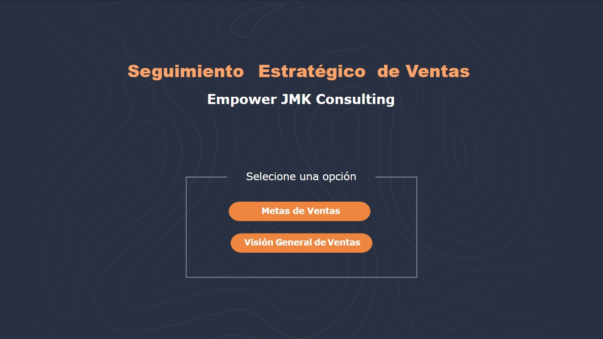
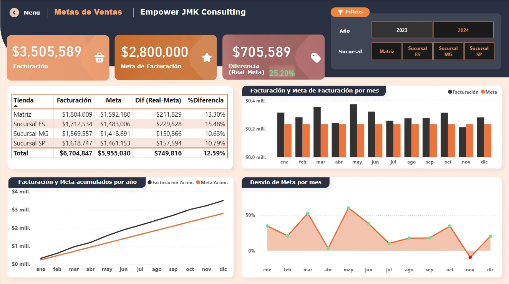
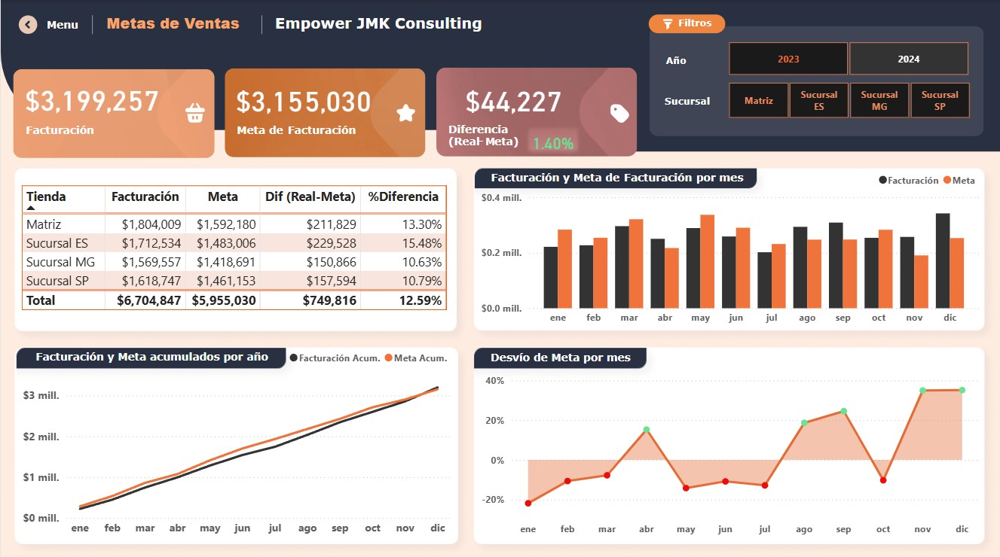
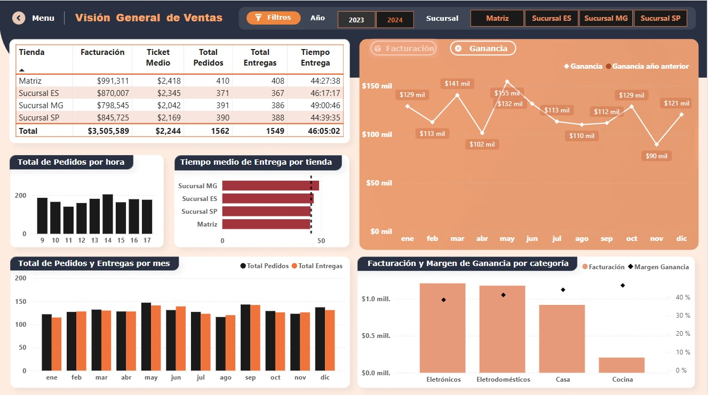
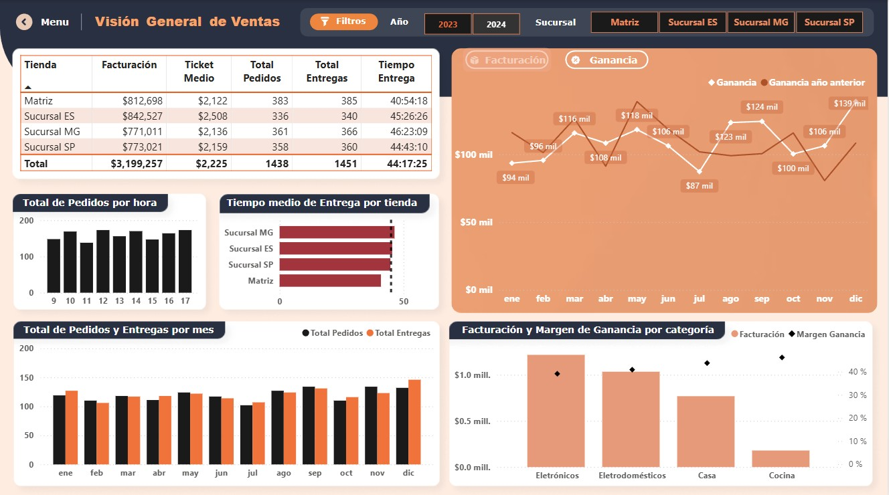

# 📊 Análisis de Ventas y Metas Comerciales | Power BI Dashboard

### Ver Dashboard
- Ver Dashboard Interactivo 👉

## 🧠 Contexto del Proyecto
Este proyecto presenta un análisis integral del desempeño comercial de una empresa retail (**Empower JMK Consulting**) a través de dashboards desarrollados en **Power BI**.

El análisis se basa en datos consolidados de **2023 y 2024**, permitiendo identificar patrones, riesgos y oportunidades estratégicas.

---

## 🎯 Objetivos del Análisis
- Medir el grado de cumplimiento de las metas de facturación.
- Comparar el desempeño interanual (2023 vs 2024).
- Captar el desempeño de las sucursales. 
- Analizar variaciones mensuales y estacionalidad.
- Evaluar la relación entre facturación y rentabilidad.
- Detectar categorías con mayor impacto en resultados.

---

## 🛠️ Herramientas Utilizadas
- **Power BI**: modelado de datos, visualizaciones e interacción.
- **DAX**: métricas de facturación, metas, desvíos, acumulados...
- **Excel / CSV**: fuente de datos
- **GitHub**: documentación y portfolio

---

## 📈 Principales KPIs Analizados
- Facturación total
- Meta de facturación
- Diferencia Real vs Meta
- % de cumplimiento
- Ganancia mensual
- Margen de ganancia por categoría

## 📸 Views del Dashboard
### Menu de Portada

### Metas de Ventas 2023 - 2024

  
  

### Visión General de Ventas (Ganancias) 2023 – 2024

  
  

---

## 🔍 Key Business Insights

### 1️⃣ Cumplimiento de Metas y Evolución Interanual
- En **2023**, la empresa superó ampliamente su meta anual:
  - Facturación: **$3.505.589**
  - Meta: **$2.800.000**
  - Desvío positivo: **+$705.589 (+25,2%)**
- En **2024**, se alcanzó la meta pero con una diferencia menor:
  - Facturación: **$3.199.257**
  - Meta: **$3.155.030**
  - Desvío positivo: **+$44.227 (+1,4%)**

📌 **Insight:**  
La empresa mantiene el cumplimiento de objetivos, pero presenta una **desaceleración del crecimiento** en 2024, reduciendo significativamente el margen de sobrecumplimiento, considerándose que la meta en 2024 es 12,68% mayor que en 2023.

---

### 2️⃣ Desempeño General por Sucursal
- **Sucursal ES** lidera el ranking con un **+15,48%** sobre su meta.
- **Matriz** muestra un desempeño sólido con **+13,30%**.
- **Sucursal MG y SP** alcanzan la meta, pero con menor eficiencia relativa arriba del **+10%**.

📌 **Insight:**  
El crecimiento no es homogéneo entre sucursales. Existen **buenas prácticas comerciales** que podrían ser replicadas en las sucursales con menor desempeño.

---

### 3️⃣ Análisis Mensual y Estacionalidad
- En **2023**, los meses de **enero, marzo, mayo y junio** presentan los mayores desvíos positivos.
- En **2024**, se observan:
  - Meses con desvíos negativos (enero, mayo, julio).
  - Recuperación marcada en el último cuatrimestre.

📌 **Insight:**  
El negocio presenta una **estacionalidad clara**, con mayor dependencia del cierre de año en 2024, lo que aumenta el riesgo operativo.

---

### 4️⃣ Relación entre Ventas y Rentabilidad
- En **2023**, la ganancia mensual se mantiene estable, con picos de hasta **$155 mil**.
- En **2024**, la ganancia es más volátil, con mínimos cercanos a **$87 mil** y recuperación hacia fin de año con hasta **$139 mil**.
- Por categoría:
  - **Electrónicos y Electrodomésticos** concentran la mayor facturación.
  - **Casa y Cocina** muestran menor volumen pero **mayores márgenes relativos**.

📌 **Insight:**  
Un mayor volumen de ventas no garantiza mayor rentabilidad. Optimizar el **mix de productos** puede mejorar el margen total del negocio.

---

## 🧠 Recomendaciones de Negocio
- Revisar metas comerciales para alinearlas al contexto real del mercado.
- Replicar estrategias exitosas de sucursales líderes.
- Diseñar campañas específicas para meses históricamente débiles.
- Priorizar categorías con mayor margen y no solo volumen de ventas.
- Monitorear rentabilidad junto con facturación para decisiones estratégicas.

---

## 👩🏻‍💼 Sobre mí
Soy **Ingeniera Civil con experiencia en gestión de proyectos**, actualmente en transición al mundo de **Data Analytics & Business Intelligence**.  
Mi enfoque combina análisis de datos con **visión de negocio y toma de decisiones estratégicas**.

📫 **Contacto**
- **LinkedIn**: *www.linkedin.com/in/rubis-becerra*
- **Portfolio Power BI**: *(agregar link)*
- **GitHub**: *https://github.com/Rubis-Becerra/Gestion-Ventas-Sales_Dashboard*

💼 **Abierta a oportunidades laborales en posiciones de Analista de Datos y Business Intelligence**.
